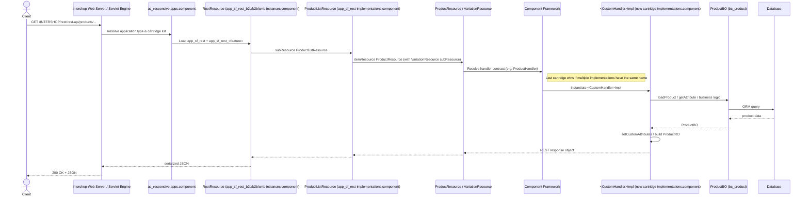

# Technical Design Document: New REST API Customization

## Executive Summary

This document describes how to add a new REST API customization to the Intershop Commerce Management (ICM) 7.10.41.5-LTS project. The design supports three primary strategies observed in the platform REST cartridges:

1. **Override an existing handler contract** by providing a new implementation with the same component name (e.g., replace the default `ProductHandler` behavior for product search).
2. **Add a new resource family** by declaring new list/item REST resources, a new handler contract, and wiring them into the existing REST root resource.
3. **Extend an existing BO-to-RO mapper** through a Guice `FunctionExtension` when the endpoint uses an extensible mapper, preserving the platform's response construction.

The implementation is delivered as a new cartridge (e.g., `app_sf_rest_<feature>`) containing a `build.gradle`, Java handler classes, component XML, and unit tests. The cartridge self-registers with the target application type(s) via an `apps-extension.component` (or `app-extension.component`) and is listed in the assembly `storefrontCartridges` so that it is packaged, ordered, and loaded.

For the overall project architecture, see [Overall Architecture](../overall-architecture.md).

Confidence: 90%.

## High-Level Technology Stack Overview

| Layer | Technology | Evidence | Confidence |
|-------|------------|----------|------------|
| Platform | Intershop Commerce Management 7.10.41.5-LTS | `build.gradle` version recommendations | 95% |
| Language | Java 8 | `build.gradle` `sourceCompatibility = 1.8` | 95% |
| Build | Gradle + Intershop `java-cartridge` / `static-cartridge` plugins | platform `app_sf_rest*` cartridges | 95% |
| REST Framework | Intershop REST framework (JSR-311 abstractions) | `app_sf_rest` `contracts.component` | 95% |
| Dependency Injection | Intershop Component Framework and Guice object graph | Component XML and `resources/<cartridge>/objectgraph/objectgraph.properties` in cartridge JARs | 95% |
| Testing | JUnit 4/5, Mockito, Hamcrest, `RequestRule` | platform test patterns, `app_sf_rest_basket_test` | 90% |
| Business API | `ProductBO`, `BasketBO`, `OrderBO`, `CustomerBO`, etc. | `app_sf_rest` component class names | 85% |

## Folder Structure for this Functionality

A new REST customization should be packaged as a dedicated cartridge:

```
app_sf_rest_<feature>/
├── build.gradle
├── src/
│   ├── main/
│   │   ├── resources/resources/app_sf_rest_<feature>/objectgraph/
│   │   │   └── objectgraph.properties           # Guice module registration
│   │   └── java/
│   │       └── com/intershop/application/rest/<domain>/
│   │           ├── capi/
│   │           │   └── resource/              # (optional) custom REST resource classes
│   │           └── internal/
│   │               └── <Feature>HandlerImpl.java
│   └── test/
│       └── java/tests/com/intershop/application/rest/<domain>/
│           └── internal/<Feature>HandlerImplTest.java
└── staticfiles/cartridge/components/
    ├── implementations.component              # handler/resource implementations
    ├── contracts.component                    # (only if new contracts are introduced)
    ├── instances.component                    # (only if new resource wiring is needed)
    └── apps-extension.component               # self-register this cartridge with the target application types
```

For an existing override (e.g., product search), only `implementations.component` and the Java handler are required. For a brand-new resource family, `contracts.component` and `instances.component` are also needed. If the new cartridge is not already selected by the target application type(s), add an `apps-extension.component` to self-register with the relevant `CartridgeListProvider`(s), following the pattern used by `app_sf_responsive_gdpr` and `ac_oidc_sf_responsive`.

Confidence: 95%.

## End-to-End Sequence Diagram

The following diagram is based on the actual component wiring found in the platform cartridges.



Source for wiring:
- `as_responsive` application type lists REST cartridges: <ref_snippet file="D:\AIEnablement\intershop-cisetup-sources\projects\corporateshop\as_responsive\staticfiles\cartridge\components\apps.component" lines="8:19"/>
- `app_sf_rest` declares `ProductListResource` with `ProductResource` item and `ProductSearchHandlerImpl`: <ref_snippet file="D:\AIEnablement\intershop-cisetup-sources\projects\corporateshop\build\server\share\system\cartridges\app_sf_rest\release\components\implementations.component" lines="55:67"/>
- `app_sf_rest` instances wire `ProductListResource` and `ProductResource`: <ref_snippet file="D:\AIEnablement\intershop-cisetup-sources\projects\corporateshop\build\server\share\system\cartridges\app_sf_rest\release\components\instances.component" lines="12:44"/>
- `app_sf_rest` root resource wiring: <ref_snippet file="D:\AIEnablement\intershop-cisetup-sources\projects\corporateshop\build\server\share\system\cartridges\app_sf_rest_b2c\release\components\instances.component" lines="5:80"/>

Confidence: 90%.

## Component / Service Patterns and Anti-Patterns

### Recommended Patterns

| Pattern | Description | Evidence | Confidence |
|---------|-------------|----------|------------|
| **Handler contract + implementation** | Declare a `<contract>` (or reuse an existing one) and an `<implementation>` with `factory="JavaBeanFactory"` | `app_sf_rest` `contracts.component`: ProductHandler, BasketHandler, etc. <ref_snippet file="D:\AIEnablement\intershop-cisetup-sources\projects\corporateshop\build\server\share\system\cartridges\app_sf_rest\release\components\contracts.component" lines="1:60"/> | 95% |
| **Name-based override** | Use the same `name` attribute as the OOTB implementation in your custom cartridge. Because later cartridges in the application list override earlier ones, the custom implementation is resolved. | `app_sf_rest` declares `name="ProductSearchHandlerImpl"`; a custom cartridge can reuse that name. <ref_snippet file="D:\AIEnablement\intershop-cisetup-sources\projects\corporateshop\build\server\share\system\cartridges\app_sf_rest\release\components\implementations.component" lines="120:121"/> | 95% |
| **Resource/Handler separation** | REST resources (`*ListResource`, `*ItemResource`, `*Resource`) only route requests and delegate to a `handler` contract. | `ProductListResource` requires `ProductHandler`; `ProductResource` requires `reviewHandler`, `variationHandler`. <ref_snippet file="D:\AIEnablement\intershop-cisetup-sources\projects\corporateshop\build\server\share\system\cartridges\app_sf_rest\release\components\implementations.component" lines="55:67"/> | 95% |
| **Scope global** | REST components use `scope="global"` because the REST API is shared across sites/sessions. | All `app_sf_rest*` component files declare `scope="global"`. | 95% |
| **Sub-resource composition** | List resources contain an `itemResource`; item resources contain `subResource` elements for nested endpoints. | `ProductResource` includes `VariationResource`; `ProductListResource` includes `ProductResource`. <ref_snippet file="D:\AIEnablement\intershop-cisetup-sources\projects\corporateshop\build\server\share\system\cartridges\app_sf_rest\release\components\instances.component" lines="12:44"/> | 95% |
| **Authentication/Authorization providers** | `RootResource` wires `TokenAuthenticationProvider` and `RESTAuthorizationService`. | `app_sf_rest_b2c` instances. <ref_snippet file="D:\AIEnablement\intershop-cisetup-sources\projects\corporateshop\build\server\share\system\cartridges\app_sf_rest_b2c\release\components\instances.component" lines="17:52"/> | 90% |

### Dependency Collision Considerations

For mapper enrichment, use the Guice libraries supplied by the platform and the REST cartridge that owns the exact mapper/RO types. Do not introduce a second Guice version to register a custom module.

REST customization cartridges depend on the Intershop `app_sf_rest`, `app_sf_rest_common`, and `rest` platform cartridges. For ICM 7.10.41.5-LTS those platform cartridges already bring `jakarta.ws.rs:jakarta.ws.rs-api:2.1.6`. Adding a different REST API artifact (e.g., `javax.ws.rs:jsr311-api:1.1.1`) causes the Gradle `checkClassCollisions` task to fail because the same `javax.ws.rs.*` classes exist in both artifacts.

Rule:

1. Use the same REST API coordinate that the platform REST cartridges use. For this project that is `jakarta.ws.rs:jakarta.ws.rs-api:2.1.6`.
2. Do not add dependencies whose packages/classes overlap with Intershop platform dependencies.
3. If a collision still appears after changing a dependency, the `build/` and `target/` outputs may be stale. Run `./gradlew clean` and then `./gradlew :inspired-b2c:checkClassCollisions` to verify.

Confidence: 95%.

### Guice Mapper Extension Pattern

The component framework wires REST resources and handler contracts; Guice also supplies typed mapper bindings. In the installed `app_sf_rest_smb` cartridge, `AppSfRestSMBMapperModule` binds the user mapper and creates the `FunctionExtension<UserBO, SMBCustomerUserRO>` set. `SMBCustomerUserROMapper` extends `ExtensibleFunction<UserBO, SMBCustomerUserRO>`. Contribute to that set from a custom `AbstractModule` with `Multibinder` and an exact `TypeLiteral`; keep the platform mapper binding. Do not treat Guice bindings as same-name, last-cartridge-wins component overrides.

Register the module with `global.modules` in `src/main/resources/resources/<cartridge>/objectgraph/objectgraph.properties`. Its runtime JAR entry must be `resources/<cartridge>/objectgraph/objectgraph.properties`. Preserve existing module entries. Separate module class names with whitespace, never commas. For a multiline value, use a backslash continuation and retain whitespace between class names. A trailing comma becomes part of the class name and causes an object-graph module-loading error. This registration is additional to assembly packaging and application cartridge selection. See the [complete module and registration example](./implementation-guide.md#10-guice-mapper-extension-and-objectgraph-registration).

For the SMB user resource, the verified conversion path is:

```text
CustomerItemUserItemResource.getCustomerUser()
  -> SMBCustomerUserROFactoryImpl.create(...) when a factory is configured
  -> injected Function<UserBO, SMBCustomerUserRO>
  -> SMBCustomerUserROMapper / ExtensibleFunction
  -> applicable FunctionExtension<UserBO, SMBCustomerUserRO> contributions
  -> existing RO serialization
```

Without a factory, the resource calls the injected mapper directly. Verify the actual resource and mapper for each application variant; a similarly named endpoint can use another response type. Source evidence is the corresponding compiled classes in `build/server/share/system/cartridges/app_sf_rest_smb/release/lib/app_sf_rest_smb.jar` and the local `CustomUserMapperModule` example. These establish the code path, not successful deployment of a particular server.

Confidence: 95%.

### Cartridge Activation Pattern

The recommended way to register a new REST customization cartridge without modifying default Intershop application-suite cartridges is:

1. Add the new cartridge to the assembly's `storefrontCartridges` list in `inspired-b2c/build.gradle` and/or `inspired-b2x/build.gradle`. Because the `order` expression uses this list, the cartridge is also placed after the base assembly cartridges.
2. Add an `apps-extension.component` (or `app-extension.component`) inside the new cartridge that fulfills `selectedCartridge` for every target application type:

```xml
<?xml version="1.0" encoding="UTF-8"?>
<components xmlns="http://www.intershop.de/component/2010">
    <fulfill requirement="selectedCartridge" value="app_sf_rest_custom" of="intershop.B2CResponsive.Cartridges" />
    <fulfill requirement="selectedCartridge" value="app_sf_rest_custom" of="intershop.SMBResponsive.Cartridges" />
    <fulfill requirement="selectedCartridge" value="app_sf_rest_custom" of="intershop.SimpleSMBResponsive.Cartridges" />
</components>
```

Evidence: `app_sf_responsive_gdpr` uses `apps-extension.component` to register itself with B2C and SMB, and `ac_oidc_sf_responsive` uses `app-extension.component` to register with B2C. Both are then listed in `inspired-b2c`/`inspired-b2x` `storefrontCartridges`.

Confidence: 95%.

### Anti-Patterns

| Anti-Pattern | Why to Avoid |
|--------------|--------------|
| Changing contract names | Existing resources depend on contracts by name; renaming breaks all consumers. |
| Defining resources without handler contracts | Resources must not contain business logic directly; they should delegate. |
| Forgetting cartridge order in application type | A custom override must be loaded after `app_sf_rest`; otherwise the default implementation wins. |
| Skipping unit tests with `RequestRule` | REST handlers often rely on `Request.getCurrent()` / `PipelineDictionary`; tests need to set this context. |
| Misplacing `objectgraph.properties` | Omitting the runtime `resources/` prefix prevents discovery of the module configuration. |
| Rebinding a mapper to add a field | Use its extension set when available; duplicate Guice bindings can fail injection and replacing the mapper can bypass existing behavior. |
| Requiring a persistent object for BO-accessible data | An unavailable persistence extension can silently omit fields even though supported BO getters provide the values. |

Confidence: 90%.

### Cartridge Activation Anti-Pattern

A very common mistake is to create a custom handler but not make the new cartridge visible to the application server. Two separate mechanisms are required:

1. **Assembly packaging** — the cartridge must appear in the assembly's `storefrontCartridges` list (and therefore in `order`) so it is deployed and appears in `cartridgelist.properties`.
2. **Application type registration** — the cartridge must add itself to the `CartridgeListProvider` of every target application (e.g., `intershop.B2CResponsive.Cartridges`, `intershop.SMBResponsive.Cartridges`, `intershop.SimpleSMBResponsive.Cartridges`) via an `apps-extension.component` or `app-extension.component` inside the new cartridge.

Evidence: `app_sf_responsive_gdpr` and `ac_oidc_sf_responsive` cartridges self-register with `intershop.B2CResponsive.Cartridges`/`intershop.SMBResponsive.Cartridges` using `apps-extension.component`/`app-extension.component`, and both are listed in `inspired-b2c`/`inspired-b2x` `storefrontCartridges`.

Confidence: 95%.

## Reusable Code, Frameworks, Libraries, Services, and Utilities

The following artifacts can be reused; do not re-implement them.

### Framework Resources

| Class / Component | Purpose | Source |
|-------------------|---------|--------|
| `AbstractRestCollectionResource` | Base class for list resources | `app_sf_rest` `implementations.component` <ref_snippet file="D:\AIEnablement\intershop-cisetup-sources\projects\corporateshop\build\server\share\system\cartridges\app_sf_rest\release\components\implementations.component" lines="55:62"/> |
| `AbstractRestResource` | Base class for item resources | `app_sf_rest` `implementations.component` <ref_snippet file="D:\AIEnablement\intershop-cisetup-sources\projects\corporateshop\build\server\share\system\cartridges\app_sf_rest\release\components\implementations.component" lines="63:67"/> |
| `RootResource` | Top-level REST API root | `app_sf_rest_b2c` `instances.component` <ref_snippet file="D:\AIEnablement\intershop-cisetup-sources\projects\corporateshop\build\server\share\system\cartridges\app_sf_rest_b2c\release\components\instances.component" lines="9:52"/> |
| `AppRootResourceAssignment` | Binds the root resource to the application | `app_sf_rest_b2c` `instances.component` <ref_snippet file="D:\AIEnablement\intershop-cisetup-sources\projects\corporateshop\build\server\share\system\cartridges\app_sf_rest_b2c\release\components\instances.component" lines="5:7"/> |
| `TokenAuthenticationProvider` | REST token authentication | `app_sf_rest_b2c` `instances.component` <ref_snippet file="D:\AIEnablement\intershop-cisetup-sources\projects\corporateshop\build\server\share\system\cartridges\app_sf_rest_b2c\release\components\instances.component" lines="17:23"/> |
| `RESTAuthorizationService` | REST authorization/permissions | `app_sf_rest_b2c` `instances.component` <ref_snippet file="D:\AIEnablement\intershop-cisetup-sources\projects\corporateshop\build\server\share\system\cartridges\app_sf_rest_b2c\release\components\instances.component" lines="24:52"/> |

### Existing Handler Contracts

Reuse one of the contracts from `app_sf_rest/release/components/contracts.component` where applicable:
- `ProductHandler` — product search / details
- `BasketHandler` / `BasketLineItemHandler` / `BasketPaymentHandler` — basket operations
- `OrderHandler` — order history / details
- `CustomerAddressHandler` / `CustomerPaymentHandler` — customer data
- `CategoryHandler`, `SearchIndexHandler`, `PromotionHandler`, etc.

<ref_snippet file="D:\AIEnablement\intershop-cisetup-sources\projects\corporateshop\build\server\share\system\cartridges\app_sf_rest\release\components\contracts.component" lines="1:80"/>

Confidence: 95%.

### Base Handler Implementations

| Class | Contract | Source |
|-------|----------|--------|
| `ProductSearchHandlerImpl` | `ProductHandler` | `app_sf_rest` `implementations.component` line 120 |
| `BasketHandlerImpl` | `BasketHandler` | `app_sf_rest` `implementations.component` line 122 |
| `OrderHandlerImpl` | `OrderHandler` | `app_sf_rest` `implementations.component` line 136 |
| `CustomerAddressHandlerImpl` | `CustomerAddressHandler` | `app_sf_rest` `implementations.component` line 154 |
| `SearchIndexHandlerImpl` | `SearchIndexHandler` | `app_sf_rest` `implementations.component` line 210 |
| `RecommendationHandlerImpl` | `RecommendationHandler` | `app_sf_rest_recomm` `implementations.component` line 45 |

These can be extended to override specific hook methods. The exact overridable methods are not present in the source tree; they must be verified against Intershop source/javadocs or the actual compiled classes. Confidence: 85%.

### Business Objects and Helpers

Use supported BO getters, public extensions, repositories, and business services for data access wherever available. Only fall back to persistence when no supported business API exposes the required value, and document that limitation. For this platform's user implementation, `BasicProfilePOToUserBOMapper` passes the profile UUID into the `ORMUserBOImpl` constructor as the BO ID; `UserBO.getID()` therefore supplies it without `PersistentObjectBOExtension`. Do not generalize that identity relationship to every BO.

| Class | Purpose | Evidence |
|-------|---------|----------|
| `ProductBO` | Product business object API | class name in `CustomProductSearchHandlerImpl` (observed) and `bc_product` dependency |
| `ProductRO.ProductROBuilder` | Builder for product REST resource objects | class name in handler references |
| `Request` / `PipelineDictionary` | Current request / pipeline dictionary | used by handlers to access `CurrentChannel` |
| `AttributeGroup` / `AttributeDescriptor` | Custom product attribute handling | class names in `CustomProductSearchHandlerImpl` |

### Test Utilities

| Class | Purpose |
|-------|---------|
| `RequestRule` | JUnit rule that provides a `Request` for unit tests |
| `NamingMgr` / `PagingMgr` | Framework managers that may need to be mocked for handler unit tests |
| Mockito / Hamcrest | Standard mocking and assertions |

Confidence: 90%.

## Detailed Dependency Mapping

```
app_sf_rest_<feature>
├── compile 'com.intershop.business:app_sf_rest'
├── compile 'com.intershop.business:app_sf_rest_common'
├── compile 'com.intershop.business:bc_<domain>'  (e.g. bc_product, bc_basket, bc_order)
├── compile 'com.intershop.platform:rest'
├── compile 'com.intershop.platform:core'
├── compile 'com.intershop.platform:businessobject'
├── compile 'jakarta.ws.rs:jakarta.ws.rs-api:2.1.6'
└── testCompile 'org.mockito:mockito-core', 'org.hamcrest:hamcrest-core', 'junit:junit', etc.
```

Source: the dependency pattern follows the platform `app_sf_rest_*` cartridges and the standard Intershop `java-cartridge` / `static-cartridge` build conventions. The local `app_sf_rest_custom` cartridge also provides a mapper registration example; its user extension requires `app_sf_rest_smb` and the `bc_user` API.

Assembly integration:
- The new cartridge must be added to the `storefrontCartridges` list of `inspired-b2c` and/or `inspired-b2x` so it is packaged and included in the `order` list (which generates `cartridgelist.properties`).
- The new cartridge must self-register with the target `CartridgeListProvider`(s) via an `apps-extension.component` (or `app-extension.component`) inside the new cartridge. This is the pattern used by `app_sf_responsive_gdpr` and `ac_oidc_sf_responsive` and avoids modifying the default `as_responsive` / `as_responsive_b2b` application-suite cartridges.

Source: `inspired-b2c` cartridge list. <ref_snippet file="D:\AIEnablement\intershop-cisetup-sources\projects\corporateshop\inspired-b2c\build.gradle" lines="54:89"/>

Confidence: 90%.

## Detailed Integration Points

### 1. HTTP Entry Point

REST requests are served by the Intershop web server at a URL such as `/INTERSHOP/rest/rest-api/...`. The prefix `rest-api` is defined by the `RootResource` `name` value. <ref_snippet file="D:\AIEnablement\intershop-cisetup-sources\projects\corporateshop\build\server\share\system\cartridges\app_sf_rest_b2c\release\components\instances.component" lines="9:14"/>

### 2. Application and Cartridge Resolution

The application type (`intershop.B2CResponsive`, `intershop.SMBResponsive`, `intershop.SimpleSMBResponsive`, etc.) resolves which cartridges are active. `as_responsive` and `as_responsive_b2b` declare the `CartridgeListProvider` instances, but a custom cartridge should not edit those application-suite files. Instead, the new cartridge self-registers by providing an `apps-extension.component` (or `app-extension.component`) that fulfills `selectedCartridge` for the relevant provider(s). This is the same pattern used by `app_sf_responsive_gdpr` and `ac_oidc_sf_responsive`. <ref_snippet file="D:\AIEnablement\intershop-cisetup-sources\projects\corporateshop\app_sf_responsive_gdpr\staticfiles\cartridge\components\apps-extension.component" lines="1:5"/>

### 3. Root Resource and Sub-Resources

`RootResource` (instance) defines the REST root, authentication, and permissions. It fulfills `subResource` with list resources such as `ProductListResource`, `BasketListResource`, `CustomerListResource`. A new list resource is added by fulfilling another `subResource` of the root. <ref_snippet file="D:\AIEnablement\intershop-cisetup-sources\projects\corporateshop\build\server\share\system\cartridges\app_sf_rest_b2c\release\components\instances.component" lines="53:80"/>

### 4. Handler Resolution

List and item resources require a `handler` contract. The component framework resolves the contract to the implementation with the matching `name`. If the new cartridge provides an implementation with the same `name` as the default, the custom one is used (last-wins). <ref_snippet file="D:\AIEnablement\intershop-cisetup-sources\projects\corporateshop\build\server\share\system\cartridges\app_sf_rest\release\components\implementations.component" lines="120:121"/>

### 5. Business Logic / Data Access

Handlers call business object APIs (`ProductBO`, `BasketBO`, etc.) which in turn use the ORM layer to query the database. This is reflected by the `bc_product`, `bc_basket`, `bc_order` dependencies declared in the platform REST cartridges.

Mapper extensions follow the same rule: read BO-accessible data through the business API instead of retrieving a persistent object. Missing optional persistence support must not suppress available BO data.

### 6. Response Serialization

The REST resource object returned by the handler is serialized to JSON by the Intershop REST framework (JSR-311 / JAX-RS style). No manual JSON writing is required. Confidence: 90%.

## Traceability

| Design Decision | Source Code Reference |
|-----------------|----------------------|
| REST cartridges are separate Intershop cartridges | `app_sf_rest`, `app_sf_rest_b2c`, `app_sf_rest_basket`, `app_sf_rest_order`, `app_sf_rest_recomm`, `app_sf_rest_smb` under `build/server/share/system/cartridges/` |
| Handler contract declarations | `build/server/share/system/cartridges/app_sf_rest/release/components/contracts.component` |
| Handler/resource implementations | `build/server/share/system/cartridges/app_sf_rest/release/components/implementations.component` |
| Resource wiring (product list/item) | `build/server/share/system/cartridges/app_sf_rest/release/components/instances.component` lines 12-44 |
| Root resource / application wiring | `build/server/share/system/cartridges/app_sf_rest_b2c/release/components/instances.component` lines 5-80 |
| Application cartridge list | `as_responsive/staticfiles/cartridge/components/apps.component` lines 8-19 |
| Assembly cartridge list | `inspired-b2c/build.gradle` lines 54-89 |

|| Cartridge self-registration pattern | `app_sf_responsive_gdpr/staticfiles/cartridge/components/apps-extension.component` lines 1-5 |
|| Custom REST cartridge self-registration | `app_sf_rest_custom/staticfiles/cartridge/components/apps-extension.component` lines 1-5 |
|| Assembly cartridge list (B2X) | `inspired-b2x/build.gradle` lines 53-70 |

## Confidence Score Summary

| Section | Confidence |
|---------|------------|
| Executive Summary | 90% |
| Technology Stack | 95% |
| Folder Structure | 95% |
| End-to-End Sequence | 90% |
| Patterns and Anti-Patterns | 90% |
| Reusable Framework Code | 95% |
| Reusable Base Handler Implementations | 85% (build output only, no source) |
| Dependency Mapping | 90% |
| Integration Points | 90% |

## Project-Wide Constraints and Non-Functional Rules

The following constraints must be observed for every design decision in this project:

1. **Default Intershop cartridges are read-only** — All custom logic, overrides, and new artifacts must be placed in project-owned cartridges (e.g., `app_sf_rest_custom`). No source, component, pipeline, or ISML changes are permitted in default Intershop starter-store or platform cartridges.
2. **Additive changes only in custom cartridges** — A custom cartridge may extend or override default behavior, but it must not remove existing functionality unless an explicit requirement to do so is documented and approved.
3. **Database migrations via `dbmigrate`** — Any DDL/DML changes must be delivered through `dbmigrate` scripts, not through DB init or DB prepare logic.
4. **Access data through business objects** — Wherever data is accessible through a BO, its public extensions, repositories, or business services, use those APIs instead of persistent objects. Use persistence access only when the required data is not exposed by a supported business API; document the gap and isolate the fallback. Verify each BO identifier and attribute API for this platform version; do not assume every BO ID is a persistence UUID.

Confidence: 95%.

## Notes and Limitations

- The source tree does **not** contain the Java source for the platform `app_sf_rest*` handlers. Class names, contracts, and wiring were extracted from the release components under `build/server/share/system/cartridges/`.
- The exact overridable hook methods of base handler classes (e.g., `ProductSearchHandlerImpl.setCustomAttributes`) are not visible in the repository. Implementation must be validated against the Intershop source/javadocs or decompiled classes.
- The original handler analysis excluded `app_sf_rest_custom`; the Guice guidance now uses its module, registration resource, and BO-based user extension as local examples alongside the installed platform classes. Live endpoint behavior requires separate deployment verification.


---